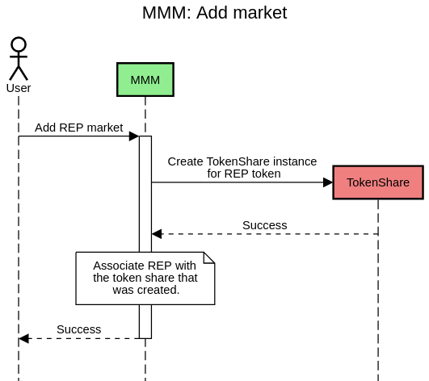
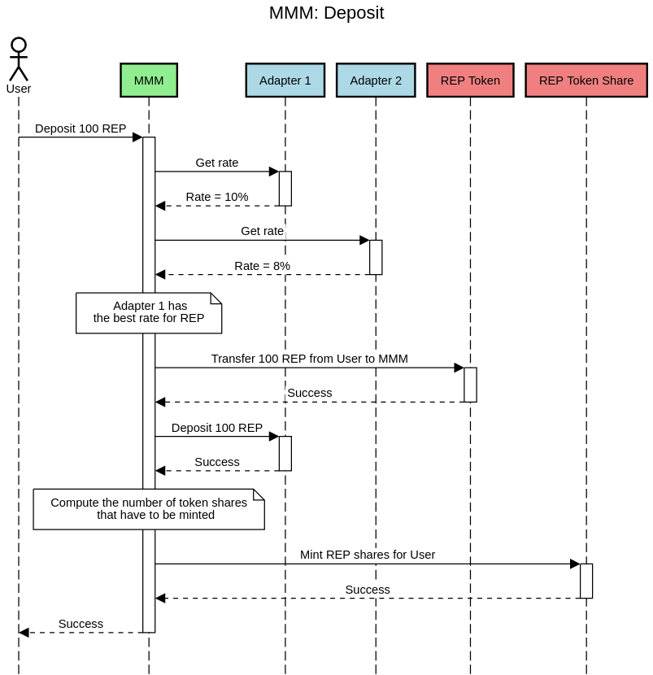
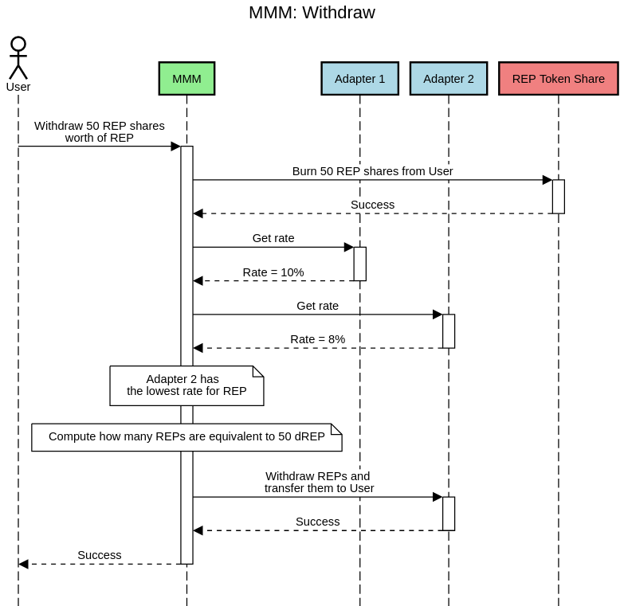

# MetaMoneyMarket

_An open source ethereum protocol that sits on top of multiple money markets, depositing funds into the highest rate, and rebalancing when it makes sense, to help you earn max interest_

[](https://circleci.com/gh/Altoros/sovereign)

## Setup

Clone the repository and install its dependencies:

```
git clone git@github.com:Altoros/sovereign.git
cd soverign
yarn
```

### Test locally

Start a ganache instance with network id 50:

```
ganache-cli -d -i 50
```

Then in another terminal deploy the contracts:

```
yarn deploy:local
```

and then start the app:

```
yarn start
```

Connect MetaMask to `localhost:8545` and import the first account from ganache.

### Test in Rinkeby

Using the private key for an account with Rinkeby ether and a URL for a Rinkeby
RPC endpoint, deploy the contracts:

```
RINKEBY_PRIVATE_KEY=abcdef... RINKEBY_RPC_URL=https://rinkeby.infura.io/... yarn deploy:rinkeby
```

Then start the app and connect MetaMask to Rinkeby:

```
yarn start
```

## The MetaMoneyMarket contract

The code for the `MetaMoneyMarket` (MMM) contract can be found in
`blockchain/contracts/MetaMoneyMarket.sol`.

Initially, the MMM doesn't support any tokens. Anybody can add support for any
ERC20 token by using the `addMarket(address)` method. This method will enable
that token and it will mint a new token that represents shares in the total
deposited amount for that token.



When a user deposits tokens, some amount of those token shares will be minted
for them. The tokens will then be deposited in the best underlying market.



If later a user burns some of those token shares, it will receive an amount of
tokens according to the exchange rate at that moment. These tokens will be taken
from the market with the lowest rate. If that market doesn't have enough tokens,
the next lowest market will be used, and so on.


